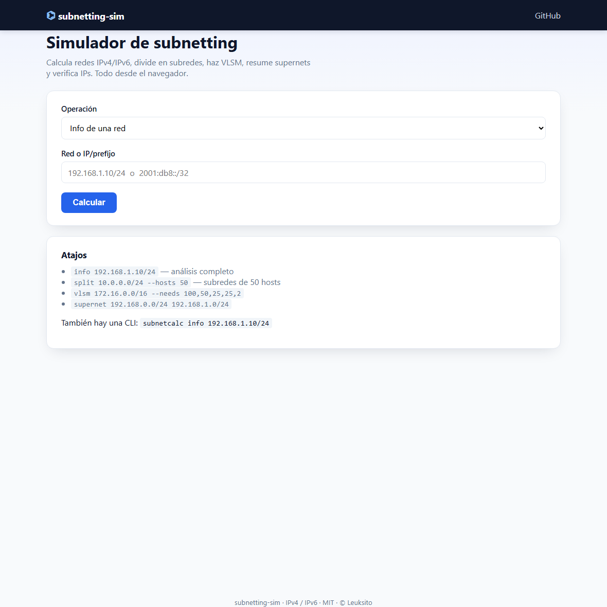
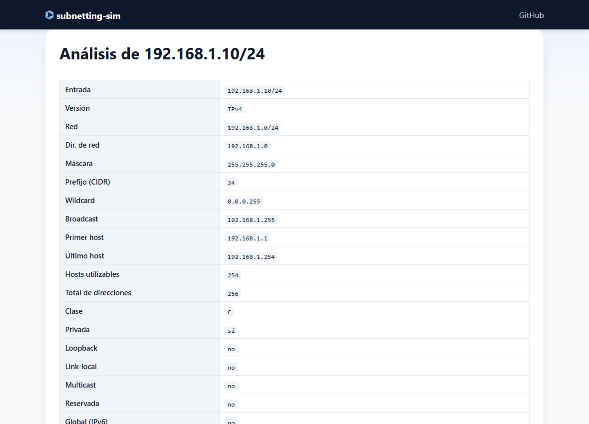
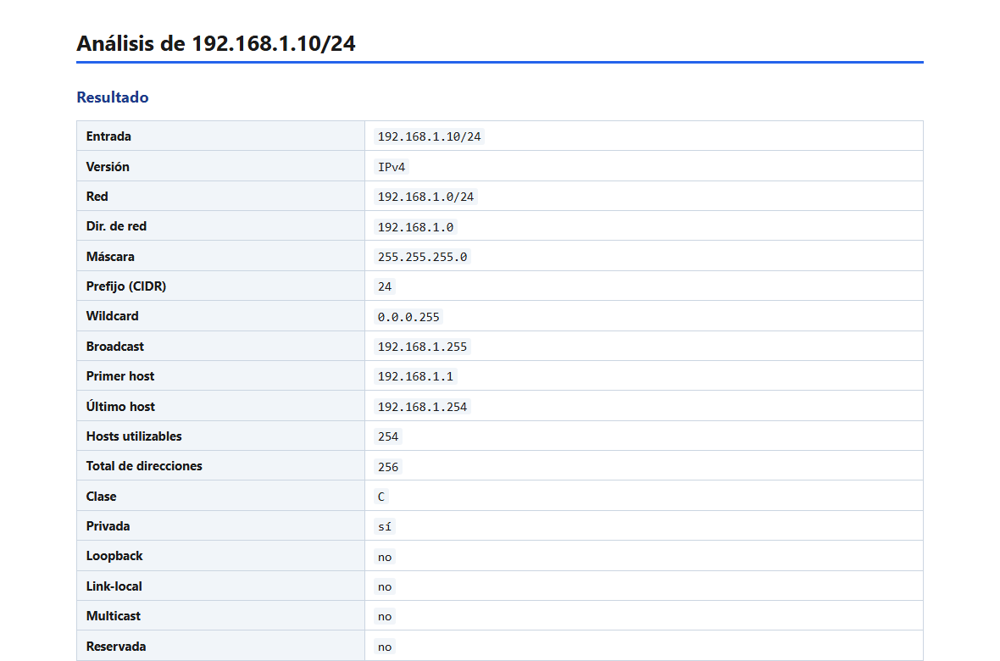
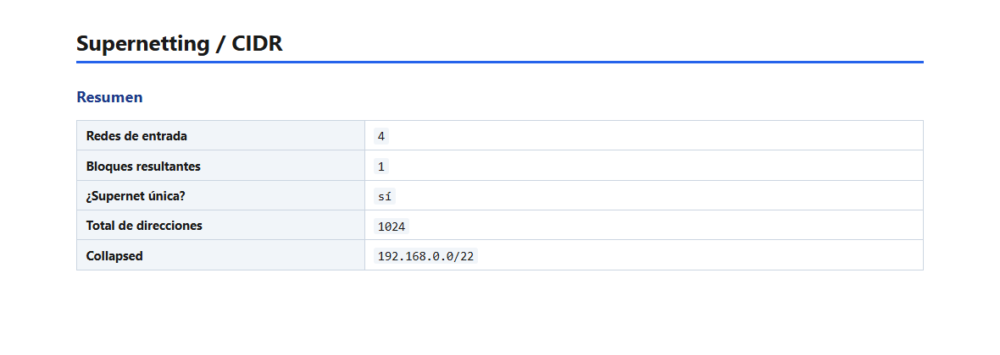
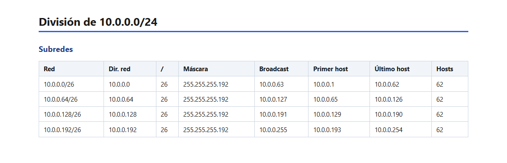
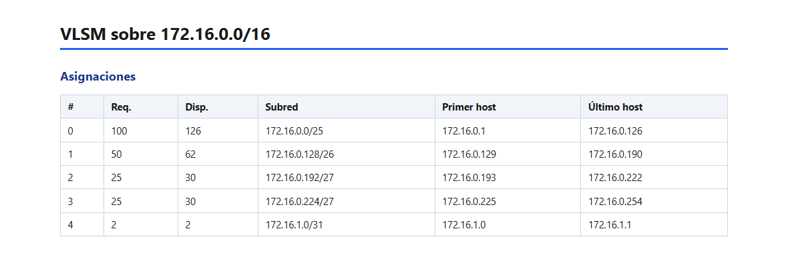
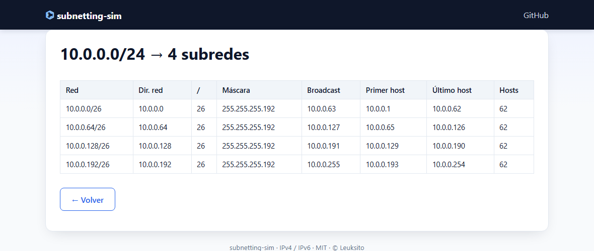
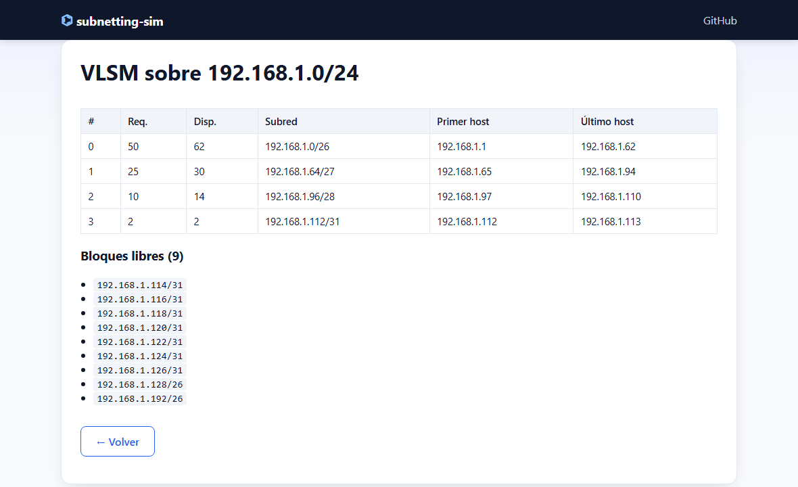

# subnetting-sim

[](https://github.com/Leuksito/subnetting-sim/actions/workflows/ci.yml)
[](https://github.com/Leuksito/subnetting-sim/actions/workflows/ci.yml)
[](https://www.python.org/)
[](LICENSE)
[](#tests)
[](https://leuksito.github.io/subnetting-sim/)

> Simulador de subnetting **IPv4/IPv6** con CLI y web: análisis de redes,
> división en subredes, **VLSM**, **supernetting/CIDR** y verificación de IPs.
> Pensado como herramienta de estudio y de uso diario para redes.

- Núcleo en **Python puro** (stdlib `ipaddress`) — sin dependencias externas para la lógica.
- Cálculo **analítico** (no materializa `hosts()`): soporta `::/0` o `/8` sin colgar.
- CLI con salida en `table | json | csv | html`.
- Web ligera en **Flask** con la misma API.
- 100% testado con `pytest` (cobertura ≥ 90% en la lógica pura).

## Capturas

<p align="center">
  &nbsp;&nbsp;
  
</p>
<p align="center">
  &nbsp;&nbsp;
  
</p>

---

## Instalación

```bash
git clone https://github.com/Leuksito/subnetting-sim.git
cd subnetting-sim
python -m venv .venv
.venv\Scripts\activate          # Windows
# source .venv/bin/activate     # macOS/Linux
pip install -e ".[dev]"
```

Tras instalar, dispondrás del comando **`subnetcalc`**.

---

## CLI

```
subnetcalc info 192.168.1.10/24
subnetcalc info 2001:db8::/32 --format json
subnetcalc split 10.0.0.0/24 --count 4
subnetcalc split 172.16.0.0/24 --hosts 50
subnetcalc vlsm 172.16.0.0/16 --needs 100,50,25,25,2
subnetcalc supernet 192.168.0.0/24 192.168.1.0/24 192.168.2.0/24 192.168.3.0/24
subnetcalc verify 192.168.1.50 192.168.1.0/24
```

### `info` — análisis de una red


Acepta `IP/prefijo`, `IP máscara` (con espacio) o una IP suelta. En IPv4 sin
máscara se infiere por clases (p. ej. `192.168.1.0` → `/24`). IPv6 sin prefijo
es `/128`.

```
$ subnetcalc info 192.168.1.10/24
  Entrada             192.168.1.10/24
  Versión             IPv4
  Red                 192.168.1.0/24
  Dir. de red         192.168.1.0
  Máscara             255.255.255.0
  Prefijo (CIDR)      24
  Wildcard            0.0.0.255
  Broadcast           192.168.1.255
  Primer host         192.168.1.1
  Último host         192.168.1.254
  Hosts utilizables   254
  Total de direcciones 256
  Clase               C
  Privada             sí
  ...
  DNS reverso         1.168.192.in-addr.arpa
```

### `split` — dividir en subredes



- `--count N`: N subredes iguales (N debe ser potencia de 2).
- `--hosts H`: subredes con **al menos** H hosts utilizables (calcula el prefijo óptimo).

### `vlsm` — subnetting de longitud variable



Asigna subredes de tamaño óptimo a partir de una lista de necesidades de hosts,
ordenadas de mayor a menor (algoritmo voraz clásico). Devuelve las asignaciones
y los **bloques libres** restantes.

### `supernet` — resumen CIDR


Fusiona varias redes en el menor número de bloques posible
(`collapse_addresses`). Indica si todo colapsa en una **supernet única** y, si no,
los bloques `spanning` que cubren el rango.

### `verify` — verificar una IP

Dice si una IP pertenece a una red y qué **rol** juega: `host`, `network`,
`broadcast` o `none` (con soporte de /31 y /32 según RFC 3021).

> **Sin máscara en IPv4**: si introduces la red sin prefijo (p. ej.
> `192.168.1.0`), se infiere la máscara **por clases** (A=/8, B=/16, C=/24,
> loopback=/8). Así `verify 192.168.1.50 192.168.1.0` responde `pertenece: sí`
> (red `192.168.1.0/24`) en vez de tratarla como `/32`. La nota indica cuándo
> la máscara fue inferida. Multicast/reservado (224–255) no se infiere.
> IPv6 sin prefijo se mantiene como `/128`.

### Formatos de salida

Todos los subcomandos admiten `--format`:

| Formato  | Uso                                   |
|----------|---------------------------------------|
| `table`  | Tabla legible en consola (por defecto)|
| `json`   | Integración con otros scripts         |
| `csv`    | Hojas de cálculo                      |
| `html`   | Página autocontenida lista para abrir |

Ejemplo:

```bash
subnetcalc split 10.0.0.0/24 --count 4 --format html > subredes.html
```

---

## Web

Aplicación Flask con un formulario único que cubre las cinco operaciones.

```bash
flask --app subnetcalc.web.app run          # debug desactivado por defecto
FLASK_DEBUG=1 flask --app subnetcalc.web.app run   # solo desarrollo local
# o:  python -m subnetcalc.web.app
```

Abre <http://127.0.0.1:5000> y elige la operación. La web reutiliza el mismo
núcleo que la CLI, así que los resultados son idénticos.

> **Demo en vivo** (sin servidor): <https://leuksito.github.io/subnetting-sim/>
> — la misma web, estática, ejecutando el Python del repo en el navegador con
> [Pyodide](https://pyodide.io). Los datos no salen de tu máquina.

<p align="center">
  &nbsp;&nbsp;
  
</p>

---

## Seguridad

Como herramienta que procesa entrada arbitraria, el proyecto está endurecido
contra los vectores realistas de su superficie de ataque:

### Anti-DoS (núcleo)
- **Cálculo analítico**: nunca se materializa `hosts()` en redes enormes
  (`::/0`, `/8`, `/64`…), por lo que `info` no cuelga.
- **Límites** en `subnetcalc/limits.py` (clase `SecurityError`):
  - `MAX_INPUT_LENGTH` (256) — longitud máxima de entrada.
  - `MAX_SUBNETS` (4096) — `split` rechaza divisiones que generarían millones
    de subredes (p. ej. `split 0.0.0.0/0 --hosts 1` → 2³² subredes).
  - `MAX_VLSM_NEEDS` / `MAX_HOSTS_NEEDED` — acota peticiones VLSM.
  - `MAX_SUPERNET_INPUTS` — acota el número de redes a resumir.

### Web (Flask)
- **CSRF**: token por sesión verificado con comparación de tiempo constante
  (`hmac.compare_digest`); POST sin token → `403`.
- **Cabeceras de seguridad**: `Content-Security-Policy` estricta
  (`script-src 'self'`, sin `unsafe-inline`/`unsafe-eval`),
  `X-Frame-Options: DENY`, `X-Content-Type-Options: nosniff`,
  `Referrer-Policy`, `Permissions-Policy`, COOP/Corp y `HSTS` en HTTPS.
- **Rate limiting**: 30 POST/min por IP (ventana deslizante) → `429`.
- **Body limit**: `MAX_CONTENT_LENGTH = 8 KB` → `413` si se excede.
- **XSS**: todo el output se escapa con `html.escape`/`markupsafe.escape`;
  los JS van en fichero externo (`static/app.js`) para permitir CSP estricta.
- **Debug desactivado por defecto**: el debugger de Werkzeug permite RCE si
  queda expuesto; solo se activa con `FLASK_DEBUG=1`.
- **Secret key**: léase de `SECRET_KEY` (ver `.env.example`); sin ella se usa
  una efímera por proceso (solo apto para uso local).

### CLI
- **Anti-inyección en terminal**: los errores se sanean
  (`sanitize.sanitize_for_display`) para eliminar secuencias ANSI/OSC
  (ANSI bombing, title spoofing), aunque las entradas ya estén validadas.
- Las entradas se validan con `ipaddress` (sin `eval`/`exec`/`subprocess`).

### CI / cadena de suministro
- `pip-audit` escanea dependencias conocidas vulnerables en cada push/PR.
- Dependabot abre PRs semanales para `pip` y `github-actions`.
- Sin dependencias de análisis de input peligrosas (`yaml`, `pickle`, etc.).

> ⚠️ Para exponer la web en Internet, usa un WSGI server (gunicorn/waitress)
> tras HTTPS, define `SECRET_KEY`, configura `ProxyFix` para obtener la IP
> real tras el proxy y considera añadir un WAF. Escuchar en `127.0.0.1`
> (por defecto) la mantiene accesible solo en local.

---

## Estructura del proyecto

```
subnetting-sim/
├── src/subnetcalc/
│   ├── core.py        # análisis IPv4/IPv6 (red, broadcast, hosts, clase, DNS reverso…)
│   ├── subnets.py     # división en subredes iguales + helpers usable_for_prefix
│   ├── vlsm.py        # VLSM (asignación voraz por necesidades)
│   ├── supernet.py    # collapse / summarize_address_range
│   ├── verify.py      # pertenencia y rol de una IP
│   ├── export.py      # JSON / CSV / HTML / texto
│   └── cli.py         # entry point argparse
├── web/
│   ├── app.py         # Flask (reutiliza el núcleo)
│   ├── templates/     # base / index / result
│   └── static/style.css
├── tests/             # un test por módulo + CLI + web
├── .github/workflows/ci.yml
├── pyproject.toml
├── LICENSE
└── README.md
```

---

## Comportamiento de bordes (notas de estudio)

| Caso            | Comportamiento                                         |
|-----------------|--------------------------------------------------------|
| IPv4 `/31`      | 2 hosts, sin broadcast (RFC 3021, punto a punto)       |
| IPv4 `/32`      | 1 host, sin broadcast                                  |
| IPv6 `/127`     | 2 hosts (RFC 6164)                                     |
| IPv6 `/128`     | 1 host                                                 |
| IPv6 general    | Sin broadcast; `::0` (subnet-router anycast) excluida |
| `::/0`          | Soportado sin colgar (cálculo analítico)              |

---

## Tests

```bash
pytest                       # todo
pytest --cov=subnetcalc --cov=cli --cov-report=term-missing
ruff check . && ruff format --check .
```

La CI de GitHub Actions ejecuta `ruff` + `pytest` en Python 3.11, 3.12, 3.13 y 3.14.

---

## Licencia

MIT © Leuksito — ver [LICENSE](LICENSE).
